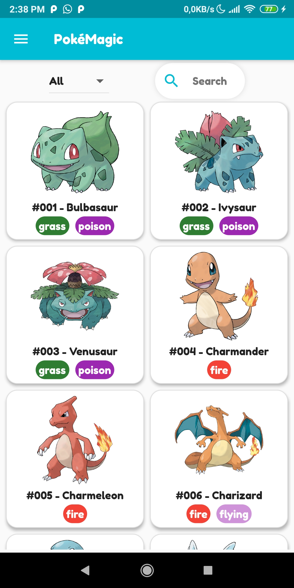
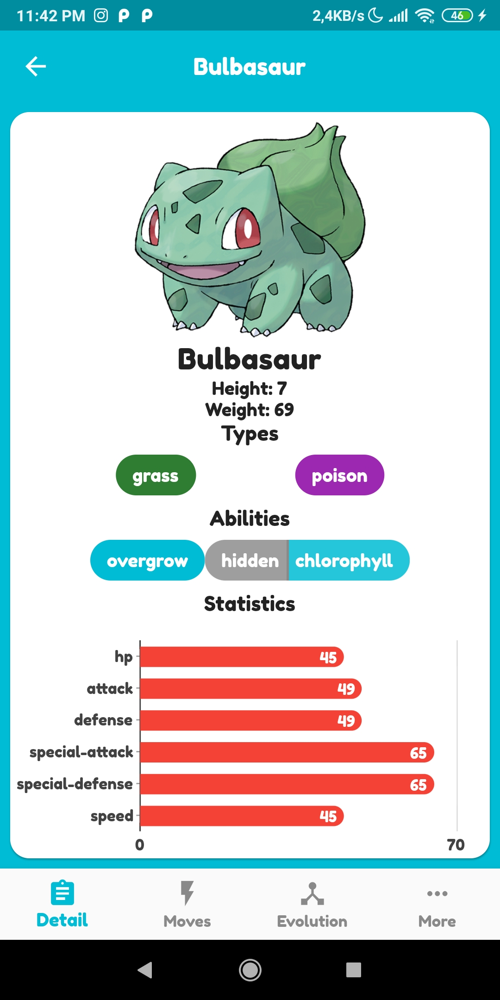
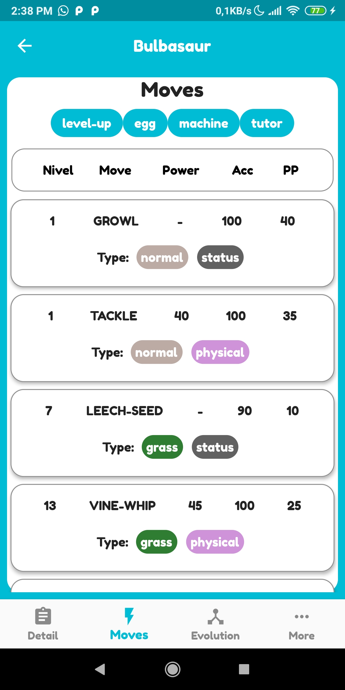
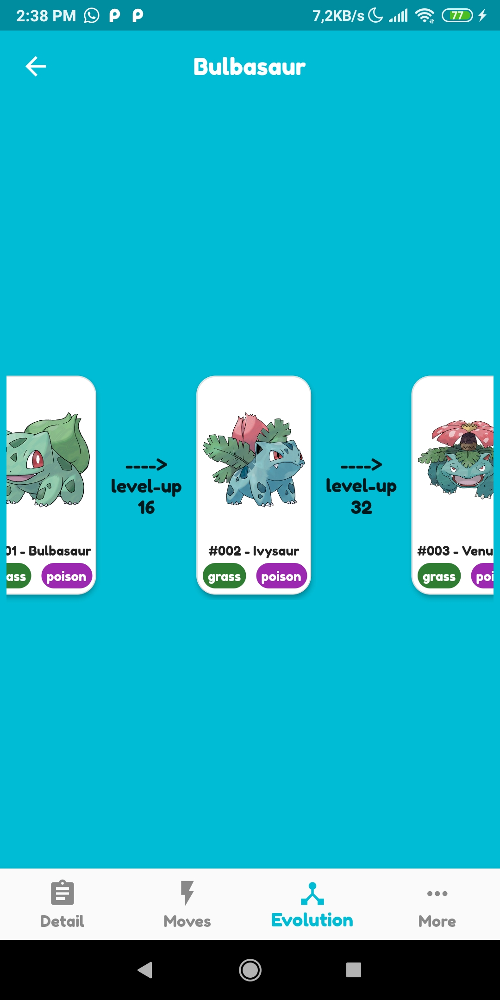
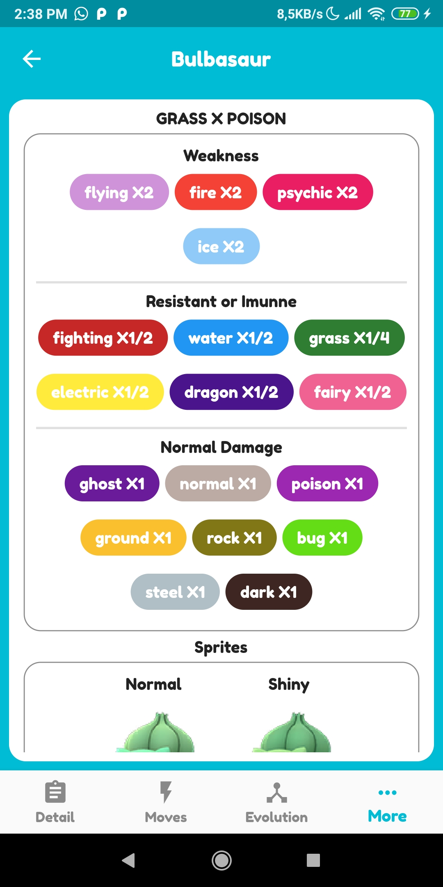
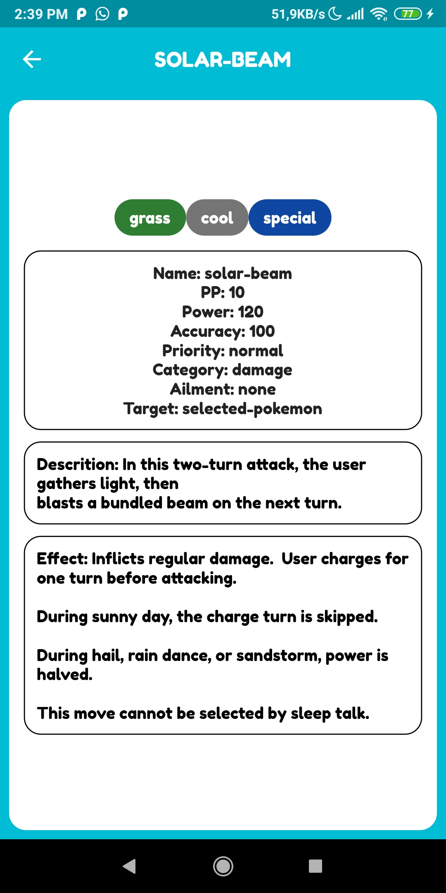
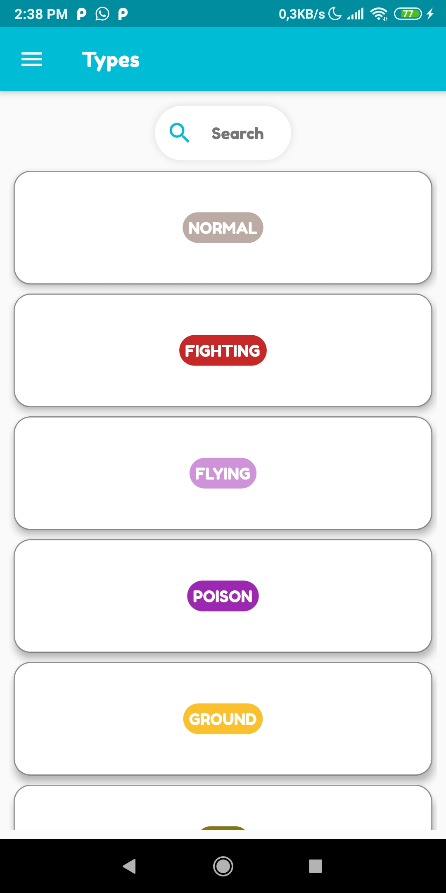
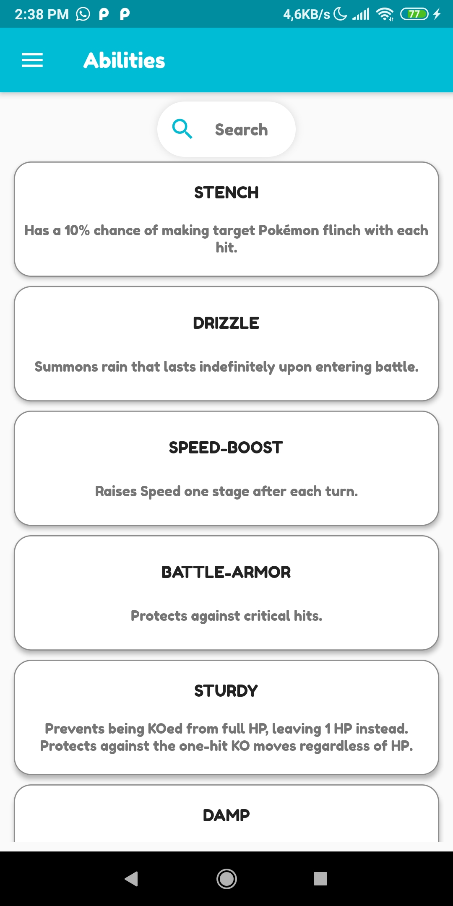

# PokéMagic
Pokédex desenvolvida em [Flutter](https://flutter.dev/) Consumindo a [PokeAPI](https://pub.dev/packages/pokeapi)

## Desenvolvimento

Aplicação desenvolvida utilizando o framework [Flutter](https://flutter.dev/) para dispositivos mobile (Android e IOS).

## Screenshots

